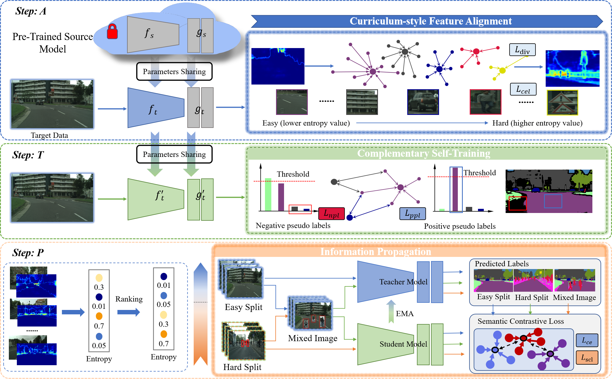

---

<div align="center">    
 
# A Curriculum-style Self-training Approach for Source-Free Semantic Segmentation

[Yuxi Wang](https://scholar.google.com/citations?user=waLCodcAAAAJ), [Jian Liang](https://scholar.google.com/citations?user=eY8i-mQAAAAJ), [Zhaoxiang Zhang](https://scholar.google.com/citations?user=qxWfV6cAAAAJ),  


<!-- /TOC -->

<div align="left">

## Architecture 

In this work, we propose **ATP**, a novel source data-free adaptation framework for semantic segmentation tasks. The proposed method consists three steps: curriculum feature alignment, complementary self-training, and information propogation. Extensive experiments have demonstrate that the prpoposed ATP boosts the performance of source data-free domain adaptation tasks.




<div align="right">
<b><a href="#architecture">↥</a></b>
</div>

## Installation

Following the repo of [SePiCo](https://github.com/BIT-DA/SePiCo), the environment is conducted as following. 

This code is implemented with `Python 3.8.5` and `PyTorch 1.7.1` on `CUDA 11.0`.

To try out this project, it is recommended to set up a virtual environment first:

```bash
# create and activate the environment
conda create --name ATP -y python=3.8.5
conda activate ATP

# install the right pip and dependencies for the fresh python
conda install -y ipython pip
```

Then, the dependencies can be installed by:

```bash
# install required packages
pip install -r requirements.txt

# install mmcv-full, this command compiles mmcv locally and may take some time
pip install mmcv-full==1.3.7  # requires other packeges to be installed first
```

**Alternatively**, the `mmcv-full` package can be installed faster with official pre-built packages, for instance:

```bash
# another way to install mmcv-full, faster
pip install mmcv-full==1.3.7 -f https://download.openmmlab.com/mmcv/dist/cu110/torch1.7.0/index.html
```

The environment is now fully prepared.

<div align="right">
<b><a href="#overview">↥</a></b>
</div>

## Datasets Preparation

### Download Datasets

- **GTAV:** Download all zipped images, along with their zipped labels, from [here](https://download.visinf.tu-darmstadt.de/data/from_games/) and extract them to a custom directory.
- **Cityscapes:** Download leftImg8bit_trainvaltest.zip and gtFine_trainvaltest.zip from [here](https://www.cityscapes-dataset.com/downloads/) and extract them to a custom directory.
- **ACDC:** Download rgb_anon_trainvaltest.zip and gt_trainval.zip from [here](https://acdc.vision.ee.ethz.ch/download) and extract them to a custom directory.


### Setup Datasets

Symlink the required datasets:

```bash
ln -s /path/to/gta5/dataset data/gta
ln -s /path/to/cityscapes/dataset data/cityscapes
```

Perform preprocessing to convert label IDs to the train IDs and gather dataset statistics:

```bash
python tools/convert_datasets/gta.py data/gta --nproc 8
python tools/convert_datasets/cityscapes.py data/cityscapes --nproc 8
```

Ultimately, the data structure should look like this:

```shell
ATP
├── ...
├── data
│   ├── cityscapes
│   │   ├── gtFine
│   │   ├── leftImg8bit
│   ├── dark_zurich
│   │   ├── corresp
│   │   ├── gt
│   │   ├── rgb_anon
│   ├── gta
│   │   ├── images
│   │   ├── labels
├── ...
```

<div align="right">
<b><a href="#overview">↥</a></b>
</div>


## Checkpoints

Below, we provide checkpoints of ATP for different benchmarks.

### GTA5 &rarr; Cityscapes (DAFormer based)
| variants | model name                           | mIoU | checkpoint download                    |
| :------- |:-------------------------------------|:----:| :------------------------------------- |
| Step A   | gta2cityscapes_daformer_aligning.pth | 54.0 | [ATP for GTA5 &rarr; Cityscapes (Alinging)](https://cashkisi-my.sharepoint.com/:u:/g/personal/yuxi_wang_cair-cas_org_hk/Eaxq71CIcpFAi3A8cmXvvu4BlFADPRrjg4sxY9mtzzW7Lw?e=DaSW0A) |
| Step T   | gta2cityscapes_daformer_teaching.pth | 62.4 | [ATP for GTA5 &rarr; Cityscapes (Teaching)](https://cashkisi-my.sharepoint.com/:u:/g/personal/yuxi_wang_cair-cas_org_hk/Ecz0Hd9Mu3JGjVHFyBg8hIUB_nOkf1Eg_SMznzxsqopNwQ?e=OjnT7B) |
| Step P  | gta2cityscapes_daformer_propagating.pth | 64.0 | [ATP for GTA5 &rarr; Cityscapes (Propagating)](https://cashkisi-my.sharepoint.com/:u:/g/personal/yuxi_wang_cair-cas_org_hk/Eah50nL6S4VLnL4ArBhrXWIBwd8qRFPdHT_92cigabpXAQ?e=G5fzYg) |

### SYNTHIA &rarr; Cityscapes (DAFormer based)
| variants | model name                           | mIoU | checkpoint download                    |
| :------- |:-------------------------------------|:----:| :------------------------------------- |
| Step A   | syn2cityscapes_daformer_aligning.pth | 56.5 | [ATP for SYNTHIA &rarr; Cityscapes (Alinging)](https://cashkisi-my.sharepoint.com/:u:/g/personal/yuxi_wang_cair-cas_org_hk/EYxMBtjwC8xErS7mvCs9NqUBfupbHb-WzEorgZLp8DhOcg?e=uztaFz) |
| Step T   | syn2cityscapes_daformer_teaching.pth | 64.9 | [ATP for SYNTHIA &rarr; Cityscapes (Teaching)](https://cashkisi-my.sharepoint.com/:u:/g/personal/yuxi_wang_cair-cas_org_hk/EcpU3AHiWVdAqpcwAEydxvEBdSZV9nI2W1Kxf2EWHeY2pg?e=hSvmwN) |
| Step P  | syn2cityscapes_daformer_propagating.pth | 66.6 | [ATP for SYNTHIA &rarr; Cityscapes (Propagating)](https://cashkisi-my.sharepoint.com/:u:/g/personal/yuxi_wang_cair-cas_org_hk/EcpBBT39Js9LrcZr3G6X03sBUBTD4voI9XoUz5n0KCIZ0g?e=r8o18K) |


### Cityscapes &rarr; ACDC (DAFormer based)
| variants | model name                           | mIoU | checkpoint download                    |
| :------- |:-------------------------------------|:----:| :------------------------------------- |
| Step A   | cityscapes2ACDC_Night_daformer_aligning.pth | 28.4 | [ATP for Cityscapes &rarr; ACDC (Night) (Alinging)](https://cashkisi-my.sharepoint.com/:u:/g/personal/yuxi_wang_cair-cas_org_hk/EcpwG1xTyABGsUSbG37lOegBQVDKdAU4GswHpmlDXqvEQQ?e=Pi6FbP) |
| Step T   | cityscapes2ACDC_Night_daformer_teaching.pth | 34.4 | [ATP for Cityscapes &rarr; ACDC (Night) (Teaching)](https://cashkisi-my.sharepoint.com/:u:/g/personal/yuxi_wang_cair-cas_org_hk/EQNQxz1QrzdAigy_FlB3AJ4BBKI-NbopI7d7dmwvv4JcvQ?e=43fezd) |
| Step P  | cityscapes2ACDC_Night_daformer_propagating.pth | 35.8 | [ATP for Cityscapes &rarr; ACDC (Night) (Propagating)](https://cashkisi-my.sharepoint.com/:u:/g/personal/yuxi_wang_cair-cas_org_hk/EYMQv9utU6dLgI4R3JVODPAB1x7st5rYbEgMfNwgJb8Lfg?e=ogwIUf) |
||||
| Step A   | cityscapes2ACDC_Fog_daformer_aligning.pth | 60.9 | [ATP for Cityscapes &rarr; ACDC (Fog) (Alinging)](https://cashkisi-my.sharepoint.com/:u:/g/personal/yuxi_wang_cair-cas_org_hk/EaCTLSjMmQBBheoLjwWtFWcBw0aZKkTRET9VnBhTVkkYIg?e=OP5l0e) |
| Step T   | cityscapes2ACDC_Fog_daformer_teaching.pth | 70.1 | [ATP for Cityscapes &rarr; ACDC (Fog) (Teaching)](https://cashkisi-my.sharepoint.com/:u:/g/personal/yuxi_wang_cair-cas_org_hk/Ea_m3Sn_1SpLvObD9oiBaKgBsVwUOPZRb29OOm-iO_j5Pw?e=JL503f) |
| Step P  | cityscapes2ACDC_Fog_daformer_propagating.pth | 72.1 | [ATP for Cityscapes &rarr; ACDC (Fog) (Propagating)](https://cashkisi-my.sharepoint.com/:u:/g/personal/yuxi_wang_cair-cas_org_hk/EZlDjJ--m6hLvP4kELX7Ov8BM6iWJsVO-lDpuSLOSpNN4w?e=Up7d8T) |
||||
| Step A   | cityscapes2ACDC_Rain_daformer_aligning.pth | 53.0 | [ATP for Cityscapes &rarr; ACDC (Rain) (Alinging)](https://cashkisi-my.sharepoint.com/:u:/g/personal/yuxi_wang_cair-cas_org_hk/EQOHQOcOyLpGrbEhVCUCu8kBi4idwdYfZFBIp2rmm9TZFQ?e=8VPYRx) |
| Step T   | cityscapes2ACDC_Rain_daformer_teaching.pth | 60.9 | [ATP for Cityscapes &rarr; ACDC (Rain) (Teaching)](https://cashkisi-my.sharepoint.com/:u:/g/personal/yuxi_wang_cair-cas_org_hk/Ecnsd8XNNFdJhpMeJk0Ir3EBHBe1YQmRBhr6iMFD1E7VGQ?e=RcQy1j) |
| Step P  | cityscapes2ACDC_Rain_daformer_propagating.pth | 63.0 | [ATP for Cityscapes &rarr; ACDC (Rain) (Propagating)](https://cashkisi-my.sharepoint.com/:u:/g/personal/yuxi_wang_cair-cas_org_hk/ETr2LqALIuBKmP1PyskCumABwF9vnx6R4jjGMbZejQdcpQ?e=hboZDn) |
||||
| Step A   | cityscapes2ACDC_Snow_daformer_aligning.pth | 54.6 | [ATP for Cityscapes &rarr; ACDC (Snow) (Alinging)](https://cashkisi-my.sharepoint.com/:u:/g/personal/yuxi_wang_cair-cas_org_hk/ET3JAmYyA75JtDSOO2noaqcBVHDZ8tPIr736jBDD-TGbYg?e=RxbU8K) |
| Step T   | cityscapes2ACDC_Snow_daformer_teaching.pth | 62.3 | [ATP for Cityscapes &rarr; ACDC (Snow) (Teaching)](https://cashkisi-my.sharepoint.com/:u:/g/personal/yuxi_wang_cair-cas_org_hk/EYvGgwV87cxChB9gmmreNdwBBoymR1WLLJ_-wNATgvTyTw?e=OnrEY3) |
| Step P  | cityscapes2ACDC_Snow_daformer_propagating.pth | 62.6 | [ATP for Cityscapes &rarr; ACDC (Snow) (Propagating)](https://cashkisi-my.sharepoint.com/:u:/g/personal/yuxi_wang_cair-cas_org_hk/EfnWNLqGVsxJjX7lts8LnvoBFoA4LuVwzpL2VuTYO9P1yQ?e=RdFoMc) |


## Training

To begin with, download [SegFormer](https://github.com/NVlabs/SegFormer)'s official MiT-B5 weights (i.e., `mit_b5.pth`) pretrained on ImageNet-1k from [here](https://drive.google.com/drive/folders/1b7bwrInTW4VLEm27YawHOAMSMikga2Ia?usp=sharing) and put it into a new folder `./pretrained`.

The training entrance is at `run_experiments.py`. To examine the setting for a specific task, please take a look at `experiments.py` for more details. Generally, the training script is given as:

```bash
python run_experiments.py --exp <exp_id>
```

<div align="right">
<b><a href="#overview">↥</a></b>
</div>


## Evaluation

### Evaluation on Cityscapes

To evaluate the pretrained models on Cityscapes, please run as follows:

```bash
python -m tools.test /path/to/config /path/to/checkpoint --eval mIoU
```


## Acknowledgments

This project is based on the following open-source projects. We thank their authors for making the source code publicly available.


- [SePiCo](https://github.com/BIT-DA/SePiCo)
- [MMSegmentation](https://github.com/open-mmlab/mmsegmentation) 
- [SegFormer](https://github.com/NVlabs/SegFormer) 
- [DAFormer](https://github.com/lhoyer/DAFormer) 
- [DACS](https://github.com/vikolss/DACS)
- [DANNet](https://github.com/W-zx-Y/DANNet) 

<div align="right">
<b><a href="#overview">↥</a></b>
</div>


<div align="right">
<b><a href="#overview">↥</a></b>
</div>


## Contact

For help and issues associated with ATP, or reporting a bug, please open a [[GitHub Issues](https://github.com/yuxiwang93/ATP/issues/new)], or feel free to contact [yuxiwang93@gmail.com](yuxiwang93@gmail.com).

